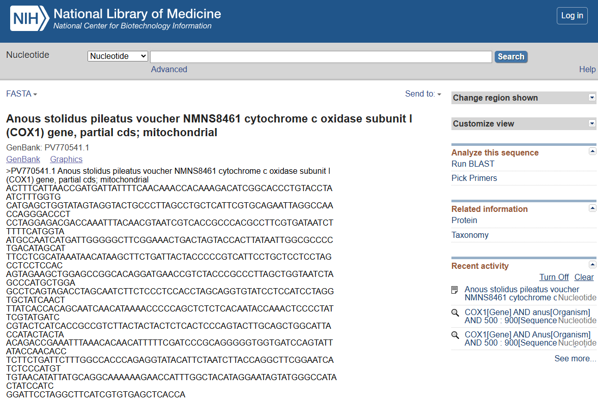
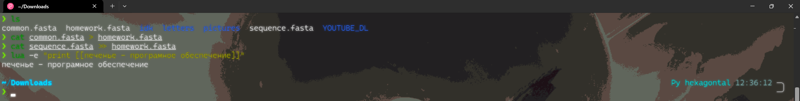
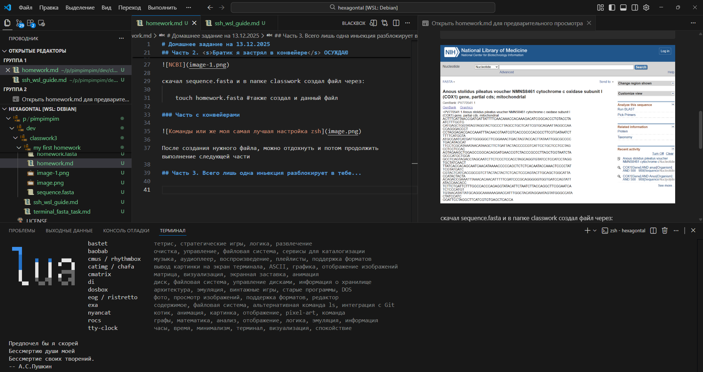

# Домашнее задание на 13.12.2025

## Основные цели работы

- Научиться пользоваться коневейерами
- Сделать файл из 10 COX-генов
- Загрузить и оформить результат в форк проекта

## Часть 1. Поток???

Pipe (конвейер) в Linux — это механизм взаимодействия между процессами, который позволяет перенаправлять вывод одной команды на вход другой без промежуточного сохранения в файл. Технически pipe — односторонний канал связи, где один процесс записывает данные в «конец трубы», а другой процесс считывает их с «начала»

## Пример
### Ввод

    echo "print [[ASTYBUX]]" | lua
###  Вывод

    ASTYBUX

## Часть 2. <s>Братик я застрял в конвейере</s> ОСУЖДАЮ

Я скачал common.fasta, зашел на NCBI вставил:

    COX1[Gene] AND anous[Organism] AND 500:900[Sequence Length] AND mitochondrion[Filter]

скачал sequence.fasta и в папке classwork создал файл через:

    touch homework.fasta #также создал и данный файл

### Часть с конвейерами

После создания нужного файла, можно отдохнуть и потом продолжить выполнение следующей части

## Часть 3. Всего лишь одна иньекция разблокирует в тебе...

Открыл мой любимый редактор кода (Visual studio code)

Открыл случайный файл из репозитория с расширением md (файл с стилем markdown <s>c элементами RPG</s> html)

Открыл панель предпросмотра, для того чтобы видеть как качественно я оформляю данный файл

После окончания всех 3 частей залил все на свой форк 

